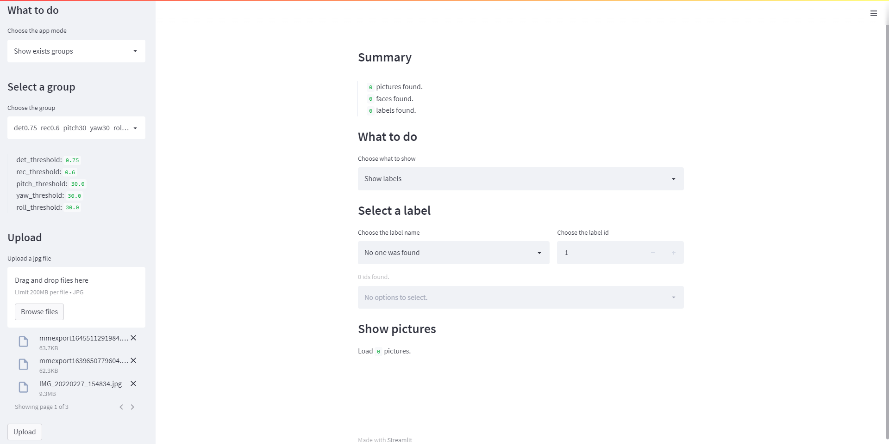
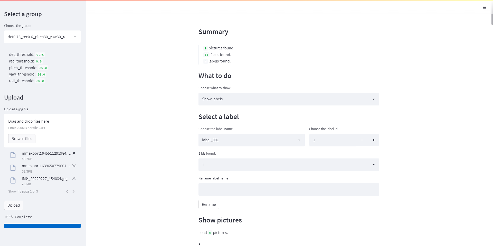

English | [简体中文](readme_cn.md)

# FaceAlbumMind

> **FaceAlbumMind** is an intelligent photo album management tool based on facial recognition. It automatically analyzes the people in your photos, detects faces, generates vectors, and clusters based on facial features, helping users effortlessly organize and manage their photos.

## Table of Contents

- [1. Introduction](#1)
- [2. Features Overview](#2)
- [3. Installation](#3)
  - [3.1 Clone the Repository](#3.1)
  - [3.2 Install Dependencies](#3.2)
- [4. Quick Start](#4)
  - [4.1 Create a New Album](#4.1)
  - [4.2 Upload Photos](#4.2)
  - [4.3 Automatic Clustering](#4.3)
  - [4.4 View Results](#4.4)
- [5. Technologies Used](#5)
- [6. Future Development](#6)
- [7. Support & Feedback](#7)

<a name="1"></a>

## 1. Introduction

**FaceAlbumMind** is a facial recognition tool based on deep learning, designed for automatic organization and management of people in your photo albums. No matter how many photos you have, FaceAlbumMind can automatically categorize individuals through facial recognition, making it easy to search and manage your photos.

### Key Features:
- **Face Detection**: Detect faces in photos using advanced deep learning algorithms.
- **Face Vectors**: Convert detected faces into feature vectors for clustering.
- **Face Clustering**: Automatically categorize similar faces based on facial features, simplifying album management.
- **Easy-to-use Interface**: Powered by Streamlit, the user interface makes it simple to upload photos and view results.

<div align="center">
  
</div>

<a name="2"></a>

## 2. Features Overview

FaceAlbumMind offers the following key features:

- **Face Detection and Recognition**: Batch process your photo albums to detect and extract faces.
- **Face Clustering**: Use facial vectors to cluster similar faces into groups.
- **Vector Search**: Planned integration with Milvus for large-scale photo search and similarity matching.
- **User-Friendly Interface**: Built with Streamlit, providing an interactive, easy-to-use front-end interface for photo management.

<a name="3"></a>

## 3. Installation

Follow these steps to install and run FaceAlbumMind.

<a name="3.1"></a>

### 3.1 Clone the Repository

First, clone the project to your local environment:

```bash
git clone https://github.com/FaceAlbumMind/SmartAlbum.git
cd SmartAlbum
```

<a name="3.2"></a>

### 3.2 Install Dependencies

FaceAlbumMind is developed using Python. Ensure you have Python 3.7 or above installed. Then, install the required dependencies with the following command:

```bash
pip install --upgrade -r requirements.txt -i https://mirrors.tuna.tsinghua.edu.cn/pypi/web/simple
```

Dependencies include:
- [InsightFace](https://github.com/deepinsight/insightface): For face detection and feature extraction.
- [Streamlit](https://github.com/streamlit/streamlit): For building the interactive front-end.
- [Milvus](https://github.com/milvus-io/milvus) (planned): For efficient vector search and management.

<a name="4"></a>

## 4. Quick Start

Once installed, you can launch FaceAlbumMind by running:

```bash
python -m streamlit run main.py
```

The FaceAlbumMind user interface will open in your local browser. Follow the steps below to explore the main features.

<a name="4.1"></a>

### 4.1 Create a New Album

Click the `New Album` button to create a new album to manage your photos. You can assign a name and description to the album for easier reference later.

<div align="center">
  
</div>

<a name="4.2"></a>

### 4.2 Upload Photos

In the album, click `Upload Photos` to select multiple photos for upload. The uploaded photos will automatically be processed, and facial features will be extracted.

<div align="center">
  
</div>

<a name="4.3"></a>

### 4.3 Automatic Clustering

Once the photos are uploaded, FaceAlbumMind will automatically perform face detection and feature extraction. After processing, the photos will be displayed, grouped by detected individuals. You can click on each group to view all photos of that person.

<div align="center">
  
</div>

<a name="4.4"></a>

### 4.4 View Results

The system will create a category for each person, allowing users to view the list of photos grouped by individuals, making it easier to search and manage photos.

<a name="5"></a>

## 5. Technologies Used

FaceAlbumMind is built using the following technologies:

- **[InsightFace](https://github.com/deepinsight/insightface)**: For face detection and feature extraction.
- **[Streamlit](https://github.com/streamlit/streamlit)**: To quickly build web-based interactive user interfaces.
- **[Pandas](https://pandas.pydata.org/)**: For data management and manipulation.
- **[Milvus](https://github.com/milvus-io/milvus)**: Planned for vector search to handle large-scale face clustering.

<a name="6"></a>

## 6. Future Development

Future development plans for FaceAlbumMind include:

- **Milvus Integration**: To enable efficient vector search, supporting large-scale photo datasets.
- **Additional Clustering Algorithms**: Support for more face clustering algorithms such as DBSCAN.
- **Multiple Classification Modes**: In addition to people-based classification, support for categorizing photos by scene, date, and other criteria.
- **Enhanced User Experience**: Add more interactive features, such as batch photo processing and tag management.

<a name="7"></a>

## 7. Support & Feedback

If you encounter any issues while using FaceAlbumMind or have suggestions, please reach out to us through:

- Submit an [Issue](https://github.com/chenwr727/FaceAlbumMind/issues)

We will respond to your feedback as soon as possible and continuously improve the project!
